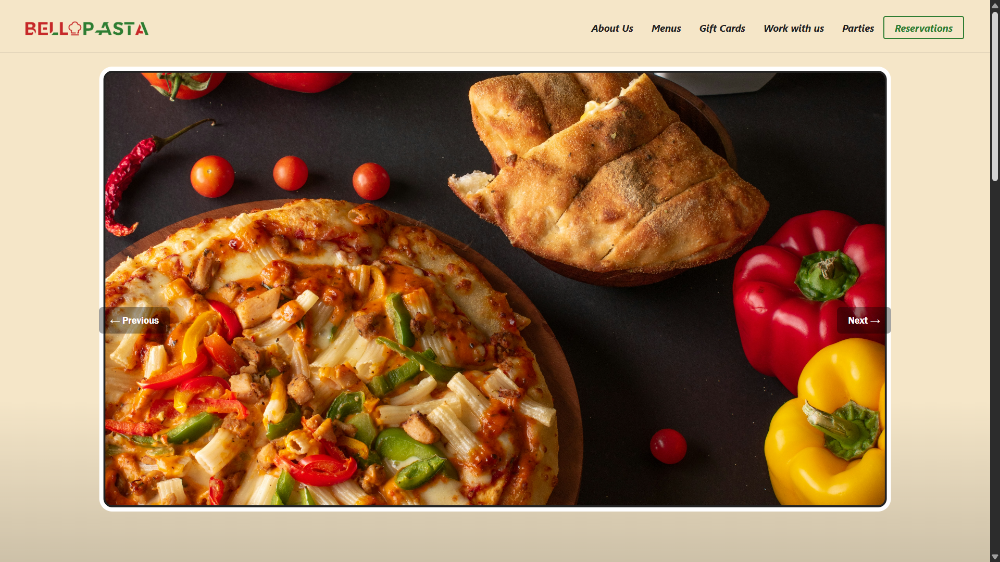
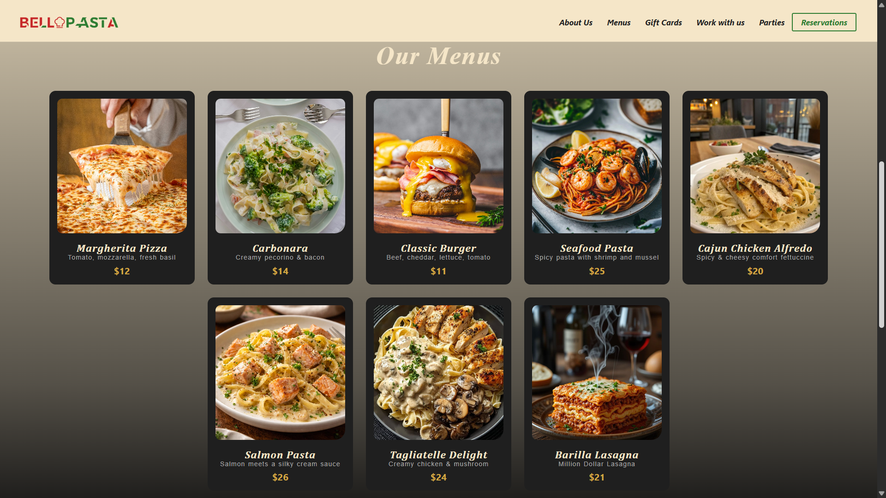
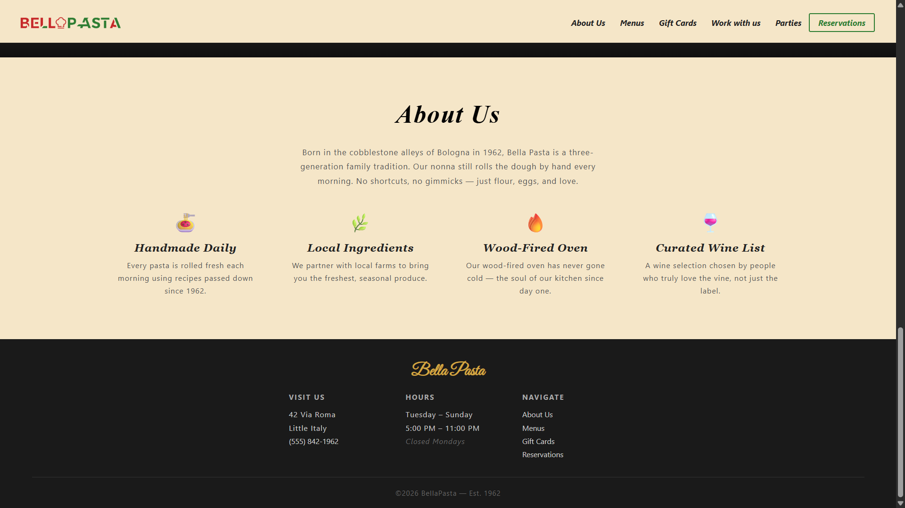
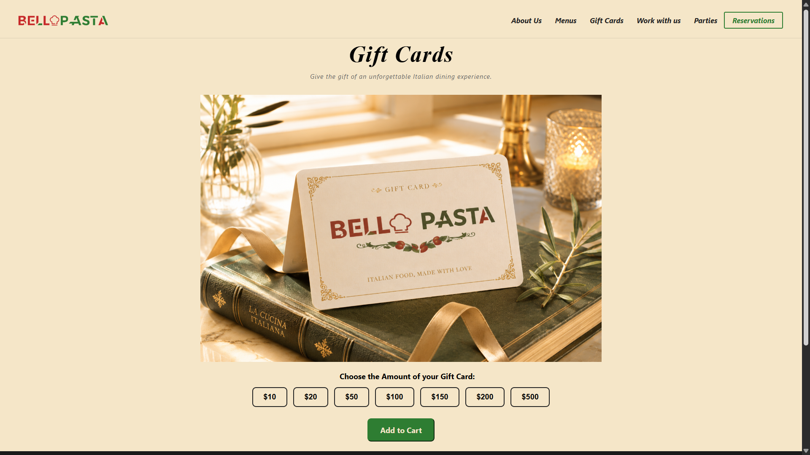
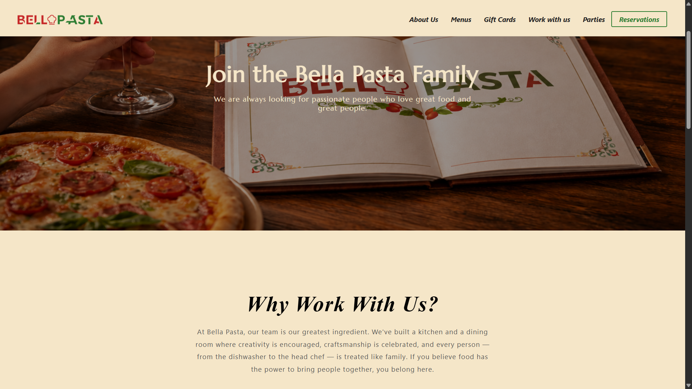
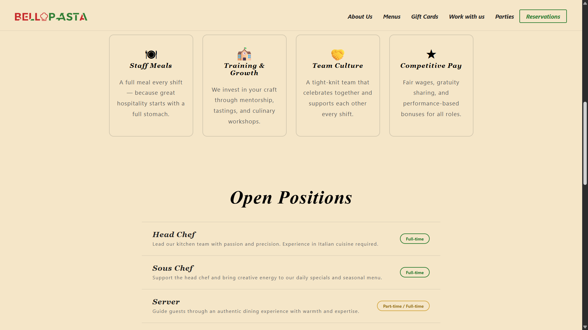
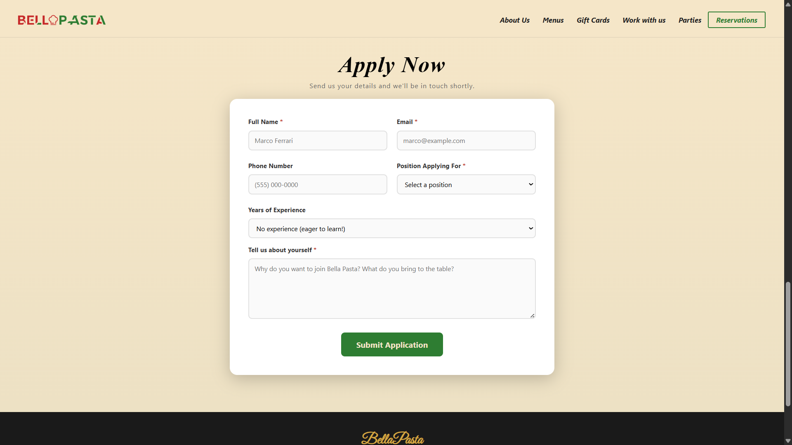
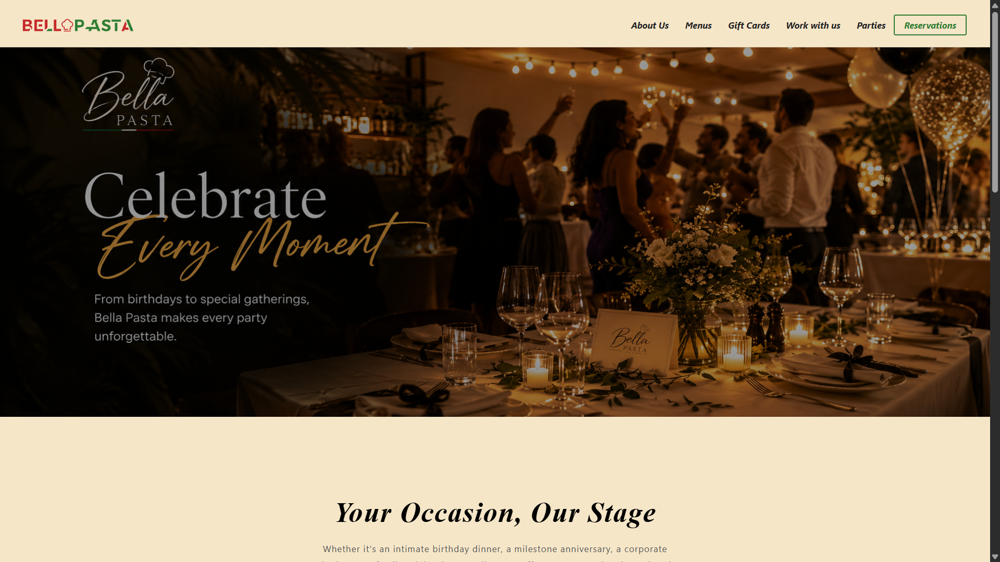
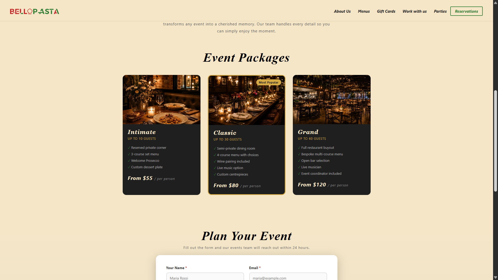
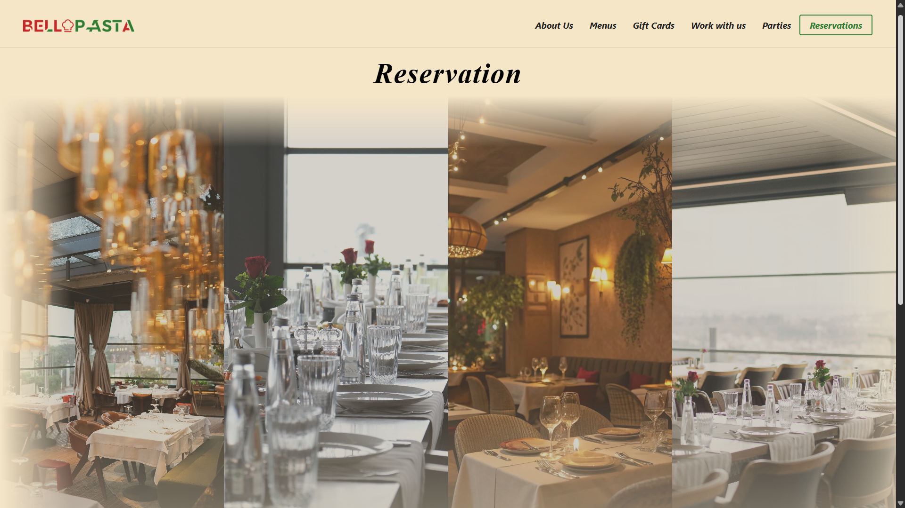

# WebProject
BellaPasta_Restaurant
# Bella Pasta 🍝

## Fictional Italian Restaurant Website Concept

Bella Pasta is a fictional Italian restaurant website concept created to showcase modern web design, responsive development, and user experience.

The goal of this project was to create a premium digital experience for a restaurant brand, including an elegant design, clear navigation, and sections that help customers discover the restaurant, menu, events, and reservation options.

---

## ✨ Features

- Modern and elegant restaurant UI design
- Fully responsive layout for desktop, tablet, and mobile
- Attractive hero section with brand identity
- Restaurant menu showcase with food categories
- Event and private party sections
- Reservation section with customer-focused design
- Smooth animations and interactive elements
- Clean navigation and organized page structure
- Optimized images for better performance

---

## 🛠️ Technologies Used

- HTML5
- CSS3
- JavaScript
- Responsive Web Design

## 📄 Pages Included

- Home Page
- Menu Page
- Parties & Events Page
- Reservation Page
- Contact Section

---

## 📸 Screenshots

### Home Page

### Menu Section

### About Us Section

### Gift Cards Page

### Work With Us Page

### Parties & Events Page

### Reservation Page

---

## 🌐 Live Demo

(https://bellapasta.vercel.app/)

---

## 📌 About This Project

Bella Pasta is a fictional restaurant website created as a personal portfolio project.

This project represents my approach to designing websites for real-world businesses by focusing on:
- Professional branding
- User-friendly layouts
- Responsive design
- Modern visual experiences

The concept can be adapted and customized for restaurants, cafés, and other hospitality businesses.

---

## 📬 Contact

Interested in working together?

- GitHub: ([My GitHub link](https://github.com/Khadija7se))
- Email: (khadija.se.dev@gmail.com)
